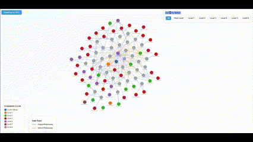

# BEV (Business Ecosystem Visualizer)

[](https://opensource.org/licenses/MIT)
[](https://github.com/T-Z-N/BEV)

A tool for visualizing business ecosystems and their relationships.

<p align="center">
  
</p>

## Status: Work in Progress

This project is currently under active development. Features and documentation are being added incrementally.

## Description

BEV is a visualization tool designed to map and analyze business ecosystems, showing connections and relationships between various entities in a business network.

## Features

- Interactive visualization of business ecosystem components
- Network relationship mapping
- Data-driven analysis capabilities
- Customizable visualization parameters

## Installation

```bash
# Clone the repository
git clone https://github.com/T-Z-N/BEV.git

# Navigate to the project directory
cd BEV

# Install dependencies
# Add your installation instructions here